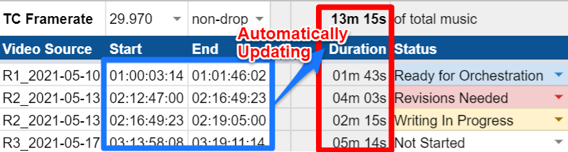

# gsheets-timecode
[](https://travis-ci.com/barndollarmusic/gsheets-timecode)

Google Sheets custom functions for working with video timecode standards and wall time durations.



*Using Microsoft Excel instead? Check out [excel-timecode](https://github.com/barndollarmusic/excel-timecode)*.

Designed for film & television composers, though these may be useful for anyone who works with
timecode values in Google Sheets.

Primary Author: [Eric Barndollar](https://barndollarmusic.com)

This is open source software that is free to use and share, as covered by the
[MIT License](LICENSE).

# Use in your own spreadsheets
The easiest way to use these functions is by making a copy of this example spreadsheet template:
- [Music Log Template](https://docs.google.com/spreadsheets/d/1xPi0lxi4-4NmZmNoTXXoCNa0FGIAhwi2QCPjTABJCw4/edit?usp=sharing)

Or if you want to start from your own existing spreadsheet, go to **Tools > Script editor** and
paste [this code](Code.js) into `Code.gs`.

# Using custom functions
Here's a spreadsheet that will walk you through how to use all of these functions:
- [Tutorial: gsheets-timecode](https://docs.google.com/spreadsheets/d/1QephM04_TBnmzdKqT3WXLeGo0JNX1N1SlD3_BdpfY0E/edit?usp=sharing)

The last 2 arguments to every function below are `frameRate` and `dropType` values.

Data validation list of supported `frameRate` values (see template above for example usage):
```
23.976,24.000,25.000,29.970,30.000,47.952,48.000,50.000,59.940,60.000
```
**IMPORTANT**: The `frameRate` value must be **Plain text** type (not a number) and include exactly
2 or 3 decimal digits after a period. This is to avoid any possible confusion over *e.g.* whether
`24` means `23.976` or `24.000`.

Data validation list of `dropType` values (see template above for example usage):
```
non-drop,drop
```

## Most common functions
All the examples below show timecode values as *Plain text* (quoted string), but you can instead use an
integer *Number* format input (which can be more convenient to type in, along with a custom number format
of `00\:00\:00\:00`).

```JavaScript
=TC_TO_WALL_SECS("00:00:01:02", "50.00", "non-drop")
```
- Yields `1.04` secs (true seconds of wall time measured from `00:00:00:00`).

```JavaScript
=WALL_SECS_BETWEEN_TCS("00:00:01:03", "00:02:05:11", "24.00", "non-drop")
```
- Yields `124.33333333...` secs (true seconds of wall time between the timecodes).

```JavaScript
=WALL_SECS_TO_DURSTR(3765)
```
- Yields `"1h 02m 45s"` (a human-readable duration string). Rounds to nearest second.

```JavaScript
=WALL_SECS_TO_TC_LEFT(1.041, "50.00", "non-drop")
```
- Yields `"00:00:01:02"`, the timecode of the closest frame that is exactly at or
before (*i.e.* to the left of) the given `wallSecs` value of `1.041` (true seconds of
wall time measured from `00:00:00:00`).

```JavaScript
=WALL_SECS_TO_TC_RIGHT(1.041, "50.00", "non-drop")
```
- Yields `"00:00:01:03"`, the timecode of the closest frame that is exactly at or
after (*i.e.* to the right of) the given `wallSecs` value of `1.041` (true seconds of
wall time measured from `00:00:00:00`).

## Other functions (more advanced)
```JavaScript
=TC_ERROR("01:02:03:04", "23.976", "non-drop")
```
- Yields an error string if timecode (or format) is invalid, or an empty string otherwise.

```JavaScript
=TC_TO_FRAMEIDX("00:00:01:02", "50.00", "non-drop")
```
- Yields `52` (the timecode refers to the 53rd frame of video, counting from `00:00:00:00` as
index 0). Dropped frames are not given index values (so in 29.97 drop, `00:00:59:29` has index
`1799` and `00:01:00:02` has index `1800`).

```JavaScript
=FRAMEIDX_TO_TC(52, "50.00", "non-drop")
```
- Yields `"00:00:01:02"`, the timecode of the given frame index.

```JavaScript
=FRAMEIDX_TO_WALL_SECS(52, "50.00", "non-drop")
```
- Yields `1.04` secs (true seconds of wall time measured from `00:00:00:00`).

```JavaScript
=WALL_SECS_TO_FRAMEIDX_LEFT(1.041, "50.00", "non-drop")
```
- Yields `52`, the frame index of the closest frame that is exactly at or
before (*i.e.* to the left of) the given `wallSecs` value of `1.041` (true seconds of
wall time measured from `00:00:00:00`).

```JavaScript
=WALL_SECS_TO_FRAMEIDX_RIGHT(1.041, "50.00", "non-drop")
```
- Yields `53`, the frame index of the closest frame that is exactly at or
after (*i.e.* to the right of) the given `wallSecs` value of `1.041` (true seconds of
wall time measured from `00:00:00:00`).

# Acknowledgements &amp; Other Resources

Special thanks to [Eduardo Delgado](https://sonicscapeproductions.com/) for suggesting improvements
and helping with the [Excel version](https://github.com/barndollarmusic/excel-timecode).

Find the link to Shie Rozow's **SR Show Cue Manager** Google Sheet template along with excellent
advice for collaborative project management and organization:
*[Scoring Films on a Shoestring Budget](https://shierozow.com/scoring-films-on-a-shoestring-budget/)*

Tim Starnes also has a great *[File Naming and Organization](https://youtu.be/z88kv81yKTk)* video on
the Cinesamples YouTube channel.

# Contributing Code
Please add tests for any changes to [Code.test.js](Code.test.js), and run all tests on the
command-line with:

```
npm test
```
